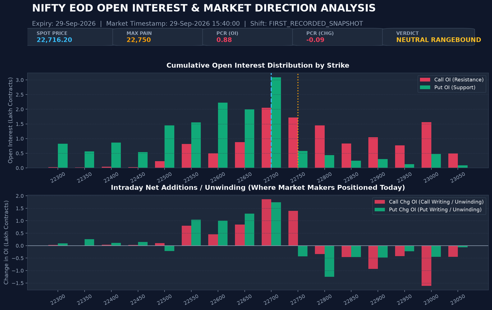

# 📈 NSE EOD Open Interest & Directional Shift Analyzer

An automated, quantitative Open Interest (OI) analysis engine for the National Stock Exchange of India (NSE). It fetches live official option chain data via official v3 APIs using `curl_cffi` browser TLS impersonation, computes Put-Call Ratios, Max Pain, Support/Resistance zones, and derivative buildups, and tracks day-over-day market regime shifts.

Runs automatically every trading day at **16:00 IST** via GitHub Actions, publishing daily Markdown reports, publication-grade dark mode charts, and an interactive GitHub Pages dashboard.

---

## 📊 Latest EOD Analysis Chart



> **Live Interactive Dashboard:** Check out the full web dashboard at `https://<your-username>.github.io/eod-oi-analysis/` (deployed automatically from `docs/`).

---

## 🚀 Key Features

- **Official NSE v3 Endpoints**: Uses official endpoints:
  - `https://www.nseindia.com/option-chain` (cookie handshake)
  - `https://www.nseindia.com/api/option-chain-contract-info?symbol=NIFTY`
  - `https://www.nseindia.com/api/option-chain-v3?type=Indices&symbol=NIFTY&expiry=...`
- **Browser TLS Impersonation**: Uses `curl_cffi` (`impersonate="chrome124"`) to reliably bypass anti-bot and Akamai rate guards without browser automation overhead.
- **Weekly & Monthly Timeframes**:
  - Automatically isolates nearest upcoming weekly expiry vs current/next monthly expiries.
  - Distinguishes tactical intraday/weekly momentum from structural monthly trends.
- **Quantitative Analytics**:
  - **Put-Call Ratio (PCR)**: Total OI PCR, Volume PCR, and Change-in-OI PCR.
  - **Max Pain**: Exact strike minimizing aggregate loss for option writers.
  - **Support & Resistance**: Dynamic detection of primary walls (S1/R1) and intraday additions/unwinding.
  - **Buildup Classification**: Strike-by-strike breakdown (Long Buildup, Short Covering, Short Buildup, Long Unwinding).
- **Directional Shift Detector**:
  - Compares today's snapshot with previous session to detect trend continuation or reversal (`BULLISH_REVERSAL`, `BEARISH_REVERSAL`, `BULL_CONTINUATION`, `BEAR_CONTINUATION`, `BREAKOUT`, `CONSOLIDATION`).
- **Multi-Format Reporting**:
  - 🎨 **PNG Chart**: High-resolution dark-mode visual card for GitHub README.
  - 📝 **Markdown**: Comprehensive EOD summary in `reports/` and GitHub Job Summary.
  - 🌐 **HTML Dashboard**: Deployed automatically to GitHub Pages (`docs/index.html`).
- **Fully Automated CI/CD**:
  - GitHub Actions runs Monday–Friday at 16:00 IST (10:30 UTC), commits updated data, and deploys GitHub Pages.

---

## 🌐 Multiple Repositories on GitHub Pages

> **Yes! You can have multiple GitHub Pages across different repositories.**
> - Your user site resides at: `https://<username>.github.io`
> - This project's dashboard resides at: `https://<username>.github.io/eod-oi-analysis/`
>
> They operate completely independently and do not conflict.
>
> **To enable GitHub Pages for this repo:**
> 1. Go to repository **Settings** -> **Pages**.
> 2. Under **Build and deployment** -> **Source**, select **GitHub Actions**.
> 3. The included workflow will automatically build and deploy `docs/` on every run.

---

## 🛠️ Local Installation & Usage

### 1. Prerequisites & Virtual Environment

```bash
git clone https://github.com/<your-username>/eod-oi-analysis.git
cd eod-oi-analysis

# Create virtual environment
python -m venv .venv

# Activate virtual environment
# Windows:
.\.venv\Scripts\activate
# Linux/macOS:
source .venv/bin/activate

# Install dependencies
pip install -r requirements.txt
```

### 2. Run Analysis

```bash
# Default: Analyze NIFTY for today's session
python main.py --symbol NIFTY

# Analyze BANKNIFTY
python main.py --symbol BANKNIFTY

# Run for a specific historical date (if raw data available)
python main.py --symbol NIFTY --date 2026-09-29
```

### 3. Run Self-Verification Tests

```bash
python tests/test_pipeline.py
```

---

## 📂 Project Structure

```text
eod-oi-analysis/
├── .agents/
│   ├── rules/
│   │   ├── antigravity-rtk-rules.md # RTK token optimization rules
│   │   └── ponytail.md              # Ponytail minimal senior dev rules
│   └── skills/                      # Registered agent skills
├── .github/
│   └── workflows/
│       └── eod_oi_analysis.yml      # Automated EOD cron runner & Pages deployer
├── data/
│   ├── history.json                 # Fast-lookup historical time series
│   └── snapshots/                   # Raw & analyzed EOD JSON snapshots
├── docs/
│   ├── index.html                   # Interactive GitHub Pages Web Dashboard
│   └── latest_oi_chart.png          # Visual chart for dashboard
├── reports/
│   ├── latest.md                    # Latest EOD Markdown summary
│   ├── latest_oi_chart.png          # Visual chart image embedded in README
│   └── EOD_OI_ANALYSIS_*.md         # Historical Markdown archive
├── src/
│   ├── config.py                    # URLs, symbols, headers & thresholds
│   ├── fetcher.py                   # curl_cffi Chrome-TLS impersonation client
│   ├── analyzer.py                  # PCR, Max Pain, Buildup & Shift detector
│   ├── storage.py                   # Historical persistence & lookup
│   ├── visualizer.py                # Publication-grade dark-mode chart plotter
│   └── reporter.py                  # Markdown, HTML & CLI formatters
├── tests/
│   └── test_pipeline.py             # Pipeline self-check verification
├── main.py                          # CLI runner entrypoint
├── requirements.txt                 # Dependencies
└── README.md                        # Documentation & Latest Visual Preview
```

---

## ⚖️ Derivative Methodology & Cheat Sheet

| Metric | Bullish Condition | Bearish Condition | Neutral / Warning |
| :--- | :--- | :--- | :--- |
| **PCR (OI)** | $> 1.20$ | $< 0.80$ | $0.80 - 1.20$ |
| **PCR (Chg OI)** | $> 1.30$ (Aggressive Put writing) | $< 0.75$ (Aggressive Call writing) | $0.75 - 1.30$ |
| **Spot vs Max Pain** | Spot $> \text{Max Pain} + 75$ | Spot $< \text{Max Pain} - 75$ | Spot $\approx \text{Max Pain}$ |
| **Call Buildup** | Short Covering (Price $\uparrow$, OI $\downarrow$) | Short Buildup (Price $\downarrow$, OI $\uparrow$) | Long Unwinding |
| **Put Buildup** | Put Writing (Price $\downarrow$, OI $\uparrow$) | Put Buying (Price $\uparrow$, OI $\uparrow$) | Put Long Unwinding |
| **Shift Verdict** | Support migrating higher, PCR $\uparrow$ | Resistance migrating lower, PCR $\downarrow$ | Sideways Rangebound |

---

## 📜 License & Disclaimer

MIT License. Educational and analytical research tool. Not financial advice. Always perform your own risk management.
